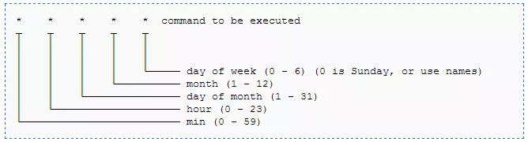

# CRON Y CRONTAB

## Crear un fichero

```
touch tarea.sh
chmod ugo+x consulta.sh
vim tarea.sh
```

**Ejemplo de sript para hacer una copia de seguridad**

```bash
#!/bin/bash
tar -czvf backup`date+%d%b%y`.tar /ruta/directorioWeb
```



**Ejemplo linea de `crontab -e` son 5 * y la ruta**

```bash
minuto mes diaMes mes diaSemana /ruta/archivo.sh
```

**Ejemplillos extra:**

```
*/2 * * * * free -mh >> /tmp/mem.txt
*/2 * * * * df -h >> /tmp/disco.txt

*/2 * * * * mv /tmp/mem.txt /home/tricky/mem$(date +\%Y-\%m-\%d-\%H\%M).txt
*/2 * * * * mv /tmp/disco.txt /home/tricky/disco$(date +\%Y-\%m-\%d-\%H\%M).txt
```

Ejecutar un .sh desde crontab:
```
* * * * * /ruta/del/sh/backup.sh
```
Hay que darle ejecución para q ejecute en archivo:
```
chmod +x /ruta/del/sh/backup.sh
```
```
1 #!/bin/bash
2
3 DB NOMBRE="moodle"
4 DB USUARIO="moodle"
5 DB CONTRA="moodle"
6
7 DIRECTORIO_BACKUPS="/home/malmorox/backups"
8 FECHA=$(date +%d-%m-%Y %H-%M-%%S)
9
10 mkdir -p $DIRECTORIO BACKUPS
11
12 FICHERO_BACKUP="$DIRECTORIO_BACKUPS/backup_moodle_$FECHA.sql" 
13
14 mysqldump -u $DB USUARIO -p$DB CONTRA $DB NOMBRE > $FICHERO BACKUP
```
```
* * * * * tar zcf /var/www/abgordinaria/t2/ej1 > /home/abgordinaria/backup.tgz
```


## Administrar Trabajos del Cron

**Remplazar archivo existente por uno que defina el usuario**

`crontab archivo`

**Editar archivo existente de crontab**

`crontab -e`

**Listar todas las tareas existentes en el crontab del usuario**

`crontab -l`

**Borrar el crontab que está configurado**

`crontab -d`

**Definir donde se almacena el archivo de corntab**

`crontab -c dir`

**Borrar el archivo de crontab de manera permanente**

`crontab -r`